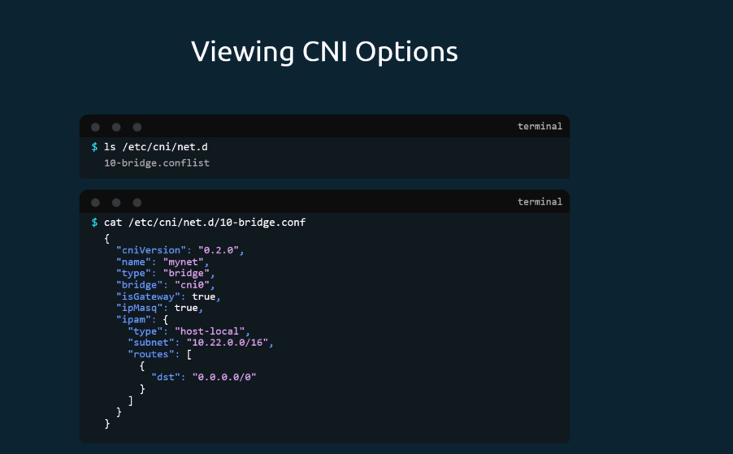
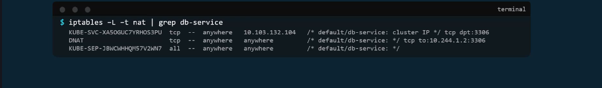

# Linux Networking Fundamentals

## 🔗 Switching and Routing Commands

### Network Interface Management

#### `ip link` - Manage Network Interfaces
```bash
# List all network interfaces
ip link show
ip link

# Show specific interface
ip link show eth0

# Bring interface up/down
sudo ip link set eth0 up
sudo ip link set eth0 down

# Create virtual interface
sudo ip link add veth0 type veth peer name veth1

# Delete interface
sudo ip link delete veth0

# Set interface MAC address
sudo ip link set eth0 address 02:42:ac:11:00:02

# Set MTU size
sudo ip link set eth0 mtu 1500
```

**Example Output**:
```
1: lo: <LOOPBACK,UP,LOWER_UP> mtu 65536 qdisc noqueue state UNKNOWN mode DEFAULT group default qlen 1000
    link/loopback 00:00:00:00:00:00 brd 00:00:00:00:00:00
2: eth0: <BROADCAST,MULTICAST,UP,LOWER_UP> mtu 1500 qdisc fq_codel state UP mode DEFAULT group default qlen 1000
    link/ether 02:42:ac:11:00:02 brd ff:ff:ff:ff:ff:ff
```

#### `ip addr` - Manage IP Addresses
```bash
# Show all IP addresses
ip addr show
ip addr
ip a

# Show specific interface addresses
ip addr show eth0

# Show only IPv4 addresses
ip -4 addr show

# Show only IPv6 addresses
ip -6 addr show

# Show brief output
ip addr show brief
```

**Example Output**:
```
2: eth0: <BROADCAST,MULTICAST,UP,LOWER_UP> mtu 1500 qdisc fq_codel state UP group default qlen 1000
    link/ether 02:42:ac:11:00:02 brd ff:ff:ff:ff:ff:ff
    inet 172.17.0.2/16 brd 172.17.255.255 scope global eth0
       valid_lft forever preferred_lft forever
    inet6 fe80::42:acff:fe11:2/64 scope link 
       valid_lft forever preferred_lft forever
```

#### `ip addr add` - Add IP Addresses
```bash
# Add IP address to interface
sudo ip addr add 192.168.1.100/24 dev eth0

# Add IP with broadcast address
sudo ip addr add 192.168.1.100/24 brd 192.168.1.255 dev eth0

# Add secondary IP address
sudo ip addr add 192.168.1.101/24 dev eth0

# Remove IP address
sudo ip addr del 192.168.1.100/24 dev eth0

# Flush all addresses from interface
sudo ip addr flush dev eth0
```

**Practical Example**:
```bash
# Configure network interface from scratch
sudo ip link set eth1 up
sudo ip addr add 10.0.1.10/24 dev eth1
sudo ip route add default via 10.0.1.1 dev eth1
```

## 🛣️ Routing Commands

#### `route -n` - Display Routing Table (Legacy)
```bash
# Show routing table (numeric format)
route -n

# Show routing table with hostnames
route

# Show IPv6 routing table
route -A inet6 -n
```

**Example Output**:
```
Kernel IP routing table
Destination     Gateway         Genmask         Flags Metric Ref    Use Iface
0.0.0.0         172.17.0.1      0.0.0.0         UG    0      0        0 eth0
172.17.0.0      0.0.0.0         255.255.0.0     U     0      0        0 eth0
```

**Flags Explanation**:
- **U** - Route is up
- **G** - Route uses gateway
- **H** - Target is a host
- **D** - Route created by daemon
- **M** - Route modified by daemon

#### `ip route` - Modern Routing Management
```bash
# Show routing table
ip route show
ip route
ip r

# Show specific route
ip route show 192.168.1.0/24

# Show routes for specific interface
ip route show dev eth0

# Show routing cache
ip route show cache
```

**Example Output**:
```
default via 172.17.0.1 dev eth0 
172.17.0.0/16 dev eth0 proto kernel scope link src 172.17.0.2
```

#### `ip route add` - Add Routes
```bash
# Add default gateway
sudo ip route add default via 192.168.1.1

# Add specific network route
sudo ip route add 10.0.0.0/8 via 192.168.1.1

# Add route through specific interface
sudo ip route add 192.168.2.0/24 dev eth1

# Add route with metric (priority)
sudo ip route add 10.0.0.0/8 via 192.168.1.1 metric 100

# Add host route
sudo ip route add 8.8.8.8 via 192.168.1.1

# Delete route
sudo ip route del 10.0.0.0/8 via 192.168.1.1

# Replace existing route
sudo ip route replace default via 192.168.1.2
```

**Advanced Routing Examples**:
```bash
# Multiple gateways (load balancing)
sudo ip route add default \
  nexthop via 192.168.1.1 weight 1 \
  nexthop via 192.168.1.2 weight 1

# Route with source address
sudo ip route add 10.0.0.0/8 via 192.168.1.1 src 192.168.1.100

# Route table manipulation
sudo ip route add 192.168.3.0/24 via 192.168.1.1 table 100
sudo ip rule add from 192.168.1.100 table 100
```

## 🌐 DNS Management

### Static Host Resolution - `/etc/hosts`

#### Understanding `/etc/hosts`
The `/etc/hosts` file provides static hostname-to-IP address mappings that override DNS lookups.

**File Format**:
```
IP_ADDRESS    HOSTNAME    [ALIASES...]
```

#### Managing `/etc/hosts`
```bash
# View current hosts file
cat /etc/hosts

# Edit hosts file
sudo nano /etc/hosts
sudo vim /etc/hosts

# Add entries to hosts file
echo "192.168.1.10 webserver" | sudo tee -a /etc/hosts
echo "192.168.1.20 database db" | sudo tee -a /etc/hosts
```

**Example `/etc/hosts` file**:
```
127.0.0.1       localhost
127.0.1.1       ubuntu-server
::1             localhost ip6-localhost ip6-loopback

# Custom entries
192.168.1.10    webserver web
192.168.1.20    database db mysql-server
192.168.1.30    cache redis-server
10.0.0.100      api-server api
10.0.0.101      auth-server auth
```

#### Testing Host Resolution
```bash
# Test hostname resolution
ping webserver
nslookup webserver
dig webserver

# Check resolution order
getent hosts webserver
```

### DNS Server Configuration

#### Why DNS Servers?
When managing many hosts, `/etc/hosts` becomes difficult because:
- **Manual updates** required on every machine
- **IP changes** need updates everywhere  
- **No central management**
- **Scalability issues** with large networks

#### DNS Server Setup

##### Install DNS Server (BIND9)
```bash
# Install BIND9 DNS server
sudo apt update
sudo apt install bind9 bind9utils bind9-doc

# Start and enable DNS service
sudo systemctl start bind9
sudo systemctl enable bind9
sudo systemctl status bind9
```

##### Configure DNS Server
```bash
# Main configuration file
sudo nano /etc/bind/named.conf.local
```

**Add zone configuration**:
```
zone "example.local" {
    type master;
    file "/etc/bind/db.example.local";
};

zone "1.168.192.in-addr.arpa" {
    type master;
    file "/etc/bind/db.192.168.1";
};
```

##### Create Forward Zone File
```bash
# Create forward zone file
sudo nano /etc/bind/db.example.local
```

**Zone file content**:
```
$TTL    604800
@       IN      SOA     ns1.example.local. admin.example.local. (
                              2         ; Serial
                         604800         ; Refresh
                          86400         ; Retry
                        2419200         ; Expire
                         604800 )       ; Negative Cache TTL

; Name servers
@       IN      NS      ns1.example.local.

; A records
ns1     IN      A       192.168.1.1
webserver IN    A       192.168.1.10
database  IN    A       192.168.1.20
cache     IN    A       192.168.1.30
api       IN    A       10.0.0.100
auth      IN    A       10.0.0.101

; CNAME records
web     IN      CNAME   webserver
db      IN      CNAME   database
redis   IN      CNAME   cache
```

##### Create Reverse Zone File
```bash
# Create reverse zone file
sudo nano /etc/bind/db.192.168.1
```

**Reverse zone content**:
```
$TTL    604800
@       IN      SOA     ns1.example.local. admin.example.local. (
                              2         ; Serial
                         604800         ; Refresh
                          86400         ; Retry
                        2419200         ; Expire
                         604800 )       ; Negative Cache TTL

; Name servers
@       IN      NS      ns1.example.local.

; PTR records
1       IN      PTR     ns1.example.local.
10      IN      PTR     webserver.example.local.
20      IN      PTR     database.example.local.
30      IN      PTR     cache.example.local.
```

##### Validate and Restart DNS
```bash
# Check configuration syntax
sudo named-checkconf

# Check zone files
sudo named-checkzone example.local /etc/bind/db.example.local
sudo named-checkzone 1.168.192.in-addr.arpa /etc/bind/db.192.168.1

# Restart DNS service
sudo systemctl restart bind9
```

#### Client DNS Configuration

##### Configure DNS Client
```bash
# Edit resolv.conf
sudo nano /etc/resolv.conf
```

**Add DNS server**:
```
nameserver 192.168.1.1
nameserver 8.8.8.8
search example.local
```

##### Permanent DNS Configuration (Ubuntu/Debian)
```bash
# Edit netplan configuration
sudo nano /etc/netplan/01-network-manager-all.yaml
```

**Netplan configuration**:
```yaml
network:
  version: 2
  ethernets:
    eth0:
      dhcp4: false
      addresses:
        - 192.168.1.100/24
      gateway4: 192.168.1.1
      nameservers:
        addresses:
          - 192.168.1.1
          - 8.8.8.8
        search:
          - example.local
```

```bash
# Apply netplan configuration
sudo netplan apply
```

#### DNS Testing Commands

##### Basic DNS Queries
```bash
# Test forward lookup
nslookup webserver.example.local
dig webserver.example.local

# Test reverse lookup
nslookup 192.168.1.10
dig -x 192.168.1.10

# Test specific record types
dig webserver.example.local A
dig example.local NS
dig example.local SOA
```

##### Advanced DNS Testing
```bash
# Query specific DNS server
nslookup webserver.example.local 192.168.1.1
dig @192.168.1.1 webserver.example.local

# Trace DNS resolution
dig +trace webserver.example.local

# Show all DNS records
dig example.local ANY

# Test DNS server response time
dig webserver.example.local | grep "Query time"
```

## 🔧 Practical Network Scenarios

### Scenario 1: Multi-Network Setup
```bash
# Configure multiple network interfaces
sudo ip addr add 192.168.1.100/24 dev eth0
sudo ip addr add 10.0.0.100/8 dev eth1

# Add routes for different networks
sudo ip route add 192.168.0.0/16 via 192.168.1.1 dev eth0
sudo ip route add 10.0.0.0/8 via 10.0.0.1 dev eth1
sudo ip route add default via 192.168.1.1 dev eth0
```

### Scenario 2: Container Networking
```bash
# Create bridge network
sudo ip link add br0 type bridge
sudo ip link set br0 up
sudo ip addr add 172.18.0.1/16 dev br0

# Create veth pair for container
sudo ip link add veth0 type veth peer name veth1
sudo ip link set veth0 master br0
sudo ip link set veth0 up

# Configure container side
sudo ip netns add container1
sudo ip link set veth1 netns container1
sudo ip netns exec container1 ip link set veth1 up
sudo ip netns exec container1 ip addr add 172.18.0.2/16 dev veth1
sudo ip netns exec container1 ip route add default via 172.18.0.1
```

### Scenario 3: DNS Failover Setup
```bash
# Configure multiple DNS servers
echo "nameserver 192.168.1.1" | sudo tee /etc/resolv.conf
echo "nameserver 8.8.8.8" | sudo tee -a /etc/resolv.conf
echo "nameserver 1.1.1.1" | sudo tee -a /etc/resolv.conf
echo "options timeout:2 attempts:3" | sudo tee -a /etc/resolv.conf
```

## 🚨 Troubleshooting Network Issues

### Network Connectivity
```bash
# Check interface status
ip link show
ip addr show

# Test connectivity
ping -c 4 8.8.8.8   #Tests connectivity between your host and a destination. Measures latency and packet loss.
traceroute 8.8.8.8  #Shows the path packets take from your host to a destination host, including each hop along the way. Useful for diagnosing routing problems.
mtr 8.8.8.8 or mtr google.com
        #mtr combines ping + traceroute in a single tool. Shows live, continuously updating statistics of each 

# Check routing
ip route show
netstat -rn
```

### DNS Troubleshooting
```bash
# Check DNS resolution
nslookup google.com  #Used to query DNS to find out domain name or IP address mapping, or other DNS records.
dig google.com       #A more advanced and modern DNS lookup tool. Provides detailed information about DNS resolution.
host google.com      #is a simple DNS lookup utility used to convert domain names to IP addresses and vice versa.

# Check DNS configuration
cat /etc/resolv.conf
systemd-resolve --status

# Flush DNS cache
sudo systemd-resolve --flush-caches
```

### Network Statistics
```bash
# Show network statistics
netstat -i  #Displays network interfaces statistics, including packets sent/received, errors, and collisions.
ss -tuln    #Shows socket statistics — active TCP/UDP connections, ports, and listening services.
iftop       #Real-time bandwidth usage monitoring per interface. Shows which hosts/IPs are consuming traffic.
nethogs     #Tracks bandwidth usage per process, unlike iftop which shows per connection.
```

## 🔧 Additional Essential Network Commands

### Network Interface Monitoring

#### `ethtool` - Ethernet Interface Information
```bash
# Show interface information
ethtool eth0

# Show interface statistics
ethtool -S eth0

# Show driver information
ethtool -i eth0

# Test interface connectivity
ethtool -t eth0

# Set interface speed
sudo ethtool -s eth0 speed 1000 duplex full
```
**Definition**: `ethtool` displays and modifies Ethernet device settings including speed, duplex, and driver information.

#### `mii-tool` - Media Independent Interface Tool
```bash
# Check link status
mii-tool eth0

# Show verbose information
mii-tool -v eth0

# Force specific speed/duplex
sudo mii-tool -F 100baseTx-FD eth0
```
**Definition**: `mii-tool` checks and configures the Media Independent Interface (MII) status of network interfaces.

### Network Configuration Files

#### `/etc/network/interfaces` (Debian/Ubuntu)
```bash
# View network configuration
cat /etc/network/interfaces

# Example static configuration
auto eth0
iface eth0 inet static
    address 192.168.1.100
    netmask 255.255.255.0
    gateway 192.168.1.1
    dns-nameservers 8.8.8.8 8.8.4.4
```

#### `/etc/sysconfig/network-scripts/` (RHEL/CentOS)
```bash
# View interface configuration
cat /etc/sysconfig/network-scripts/ifcfg-eth0

# Example configuration
DEVICE=eth0
BOOTPROTO=static
IPADDR=192.168.1.100
NETMASK=255.255.255.0
GATEWAY=192.168.1.1
DNS1=8.8.8.8
ONBOOT=yes
```

### Network Service Management

#### `systemctl` - Network Service Control
```bash
# Restart networking service
sudo systemctl restart networking
sudo systemctl restart NetworkManager

# Check network service status
sudo systemctl status networking
sudo systemctl status NetworkManager

# Enable/disable network service
sudo systemctl enable NetworkManager
sudo systemctl disable NetworkManager
```

#### `service` - Legacy Service Control
```bash
# Restart network service (legacy)
sudo service networking restart
sudo service network restart

# Check service status
sudo service networking status
```

### Advanced Network Diagnostics

#### `tcpdump` - Packet Capture and Analysis
```bash
# Capture packets on interface
sudo tcpdump -i eth0

# Capture specific protocol
sudo tcpdump -i eth0 tcp port 80
sudo tcpdump -i eth0 udp port 53

# Capture and save to file
sudo tcpdump -i eth0 -w capture.pcap

# Read from file
tcpdump -r capture.pcap

# Capture with filters
sudo tcpdump -i eth0 host 192.168.1.10
sudo tcpdump -i eth0 net 192.168.1.0/24
```
**Definition**: `tcpdump` captures and analyzes network packets for troubleshooting and monitoring network traffic.

#### `wireshark` / `tshark` - Advanced Packet Analysis
```bash
# Command-line packet capture
tshark -i eth0

# Capture with display filter
tshark -i eth0 -f "tcp port 80"

# Save to file
tshark -i eth0 -w capture.pcapng
```

### Network Performance Testing

#### `iperf3` - Network Bandwidth Testing
```bash
# Server mode
iperf3 -s

# Client mode
iperf3 -c server_ip

# UDP test
iperf3 -c server_ip -u

# Test for specific duration
iperf3 -c server_ip -t 30
```
**Definition**: `iperf3` measures network bandwidth between two hosts for performance testing.

#### `nc` (netcat) - Network Swiss Army Knife
```bash
# Listen on port
nc -l 8080

# Connect to host/port
nc google.com 80

# Port scanning
nc -zv google.com 80-90

# Transfer files
# Receiver: nc -l 8080 > file.txt
# Sender: nc target_ip 8080 < file.txt
```
**Definition**: `nc` (netcat) is a versatile networking utility for reading/writing data across network connections.

### Firewall and Security

#### `iptables` - Firewall Rules
```bash
# List rules
sudo iptables -L
sudo iptables -L -n -v

# Add rule to allow SSH
sudo iptables -A INPUT -p tcp --dport 22 -j ACCEPT

# Block specific IP
sudo iptables -A INPUT -s 192.168.1.100 -j DROP

# Save rules
sudo iptables-save > /etc/iptables/rules.v4
```

#### `ufw` - Uncomplicated Firewall
```bash
# Enable firewall
sudo ufw enable

# Allow service
sudo ufw allow ssh
sudo ufw allow 80/tcp

# Deny traffic
sudo ufw deny from 192.168.1.100

# Check status
sudo ufw status verbose
```

### Network Namespace Deep Dive

#### Complete Network Namespace Operations
```bash
# Create network namespace
sudo ip netns add red
sudo ip netns add blue

# List namespaces
ip netns list
ip netns

# Execute commands in namespace
sudo ip netns exec red ip link show
sudo ip -n red link show  # Shorthand

# Create veth pair
sudo ip link add veth-red type veth peer name veth-blue

# Move interfaces to namespaces
sudo ip link set veth-red netns red
sudo ip link set veth-blue netns blue

# Configure IP addresses
sudo ip -n red addr add 192.168.15.1/24 dev veth-red
sudo ip -n blue addr add 192.168.15.2/24 dev veth-blue

# Bring interfaces up
sudo ip -n red link set veth-red up
sudo ip -n blue link set veth-blue up

# Test connectivity
sudo ip netns exec red ping 192.168.15.2

# Check ARP tables
sudo ip netns exec red arp
sudo ip netns exec blue arp

# Delete namespace
sudo ip netns del red
```
**Definition**: Network namespaces provide isolated network stacks, allowing multiple independent network configurations on a single host.

### Bridge Networking

#### Linux Bridge Configuration
```bash
# Create bridge
sudo ip link add br0 type bridge
sudo ip link set br0 up

# Add interface to bridge
sudo ip link set eth0 master br0

# Configure bridge IP
sudo ip addr add 192.168.1.1/24 dev br0

# Show bridge information
bridge link show
bridge fdb show

# Remove interface from bridge
sudo ip link set eth0 nomaster
```
**Definition**: Linux bridges connect multiple network segments, operating at Layer 2 to forward traffic between connected interfaces.

### VLAN Configuration

#### VLAN Interface Management
```bash
# Create VLAN interface
sudo ip link add link eth0 name eth0.100 type vlan id 100

# Configure VLAN IP
sudo ip addr add 192.168.100.1/24 dev eth0.100
sudo ip link set eth0.100 up

# Show VLAN information
ip -d link show eth0.100

# Delete VLAN interface
sudo ip link del eth0.100
```
**Definition**: VLANs (Virtual LANs) segment network traffic logically, allowing multiple isolated networks over the same physical infrastructure.

This comprehensive guide covers all essential Linux networking commands and DNS management techniques needed for understanding network fundamentals in Kubernetes environments.


## 🌐 CoreDNS Configuration

### CoreDNS - Modern DNS Server

**Definition**: CoreDNS is a flexible, extensible DNS server that can serve as the Kubernetes cluster DNS. It's written in Go and uses plugins for functionality.

#### CoreDNS Installation and Setup
```bash
# Download CoreDNS binary
curl -LO https://github.com/coredns/coredns/releases/download/v1.12.4/coredns_1.12.4_linux_amd64.tgz
tar -zxf coredns_1.12.4_linux_amd64.tgz

# Make executable
chmod +x coredns

# Run CoreDNS (listens on port 53 by default)
./coredns

# Run with custom config
./coredns -conf Corefile

# Run on custom port
./coredns -dns.port=5353
```

#### Advanced CoreDNS Configuration
```bash
# Multi-zone Corefile
example.local:53 {
    file /etc/coredns/db.example.local
    log
    errors
}

company.internal:53 {
    file /etc/coredns/db.company.internal
    log
    errors
}

.:53 {
    forward . 8.8.8.8 8.8.4.4
    cache 300
    log
    errors
}
```

### Prerequisite - CoreDNS

In the previous lecture, we saw why you need a DNS server, how it can help manage name resolution in large environments with many hostnames and Ips, and how you can configure your hosts to point to a DNS server. In this article, we will see how to configure a host as a DNS server.

We are given a server dedicated as the DNS server and a set of IPs to configure as entries in the server. There are many DNS server solutions out there; in this lecture, we will focus on a particular one – CoreDNS.

So, how do you get core DNS? CoreDNS binaries can be downloaded from their Github releases page or as a docker image. Let’s go the traditional route. Download the binary using curl or wget. And extract it. You get the coredns executable

    $ curl -LO https://github.com/coredns/coredns/releases/download/v1.12.4/coredns_1.12.4_linux_amd64.tgz
    $ tar -zxf coredns_1.12.4_linux_amd64.tgz 

Run the executable to start a DNS server. It, by default, listens on port 53, which is the default port for a DNS server.

Now, we haven’t specified the IP to hostname mappings. For that, you need to provide some configurations. There are multiple ways to do that. We will look at one.

First, we put all of the entries into the DNS servers /etc/hosts file. Then, we configure CoreDNS to use that file. CoreDNS loads its configuration from a file named Corefile.

Here is a simple configuration that instructs CoreDNS to fetch the IP to hostname mappings from the file /etc/hosts. When the DNS server is run, it now picks the IPs and names from the /etc/hosts file on the server.

    .:53 {
        # Use /etc/hosts to resolve hostname
        hosts /etc/hosts {
            reload 1m
            fallthrough
        }
     
        # Forward unmatched queries to the host's resolver
        forward . /etc/resolv.conf {
           max_concurrent 1000
        }
        cache 30
        log
        errors
    }

CoreDNS also supports other ways of configuring DNS entries through plugins. We will look at the plugin that it uses for Kubernetes in a later section.

Read more about CoreDNS here:

https://github.com/kubernetes/dns/blob/master/docs/specification.md

https://coredns.io/plugins/kubernetes/


## 🔗 Network Namespaces Deep Dive

**Definition**: Network namespaces provide isolated network stacks, allowing multiple independent network configurations on a single Linux host. Each namespace has its own network interfaces, routing tables, and firewall rules.

### Network Namespace Commands

#### Create and Manage Namespaces
```bash
# Create new network namespaces
sudo ip netns add red
sudo ip netns add blue

# List all namespaces
ip netns list
ip netns

# Delete namespace
sudo ip netns del red

# Execute command in namespace
sudo ip netns exec red ip link show
sudo ip -n red link show  # Shorthand syntax
```

#### Complete Network Namespace Setup
```bash
# Step 1: Create namespaces
sudo ip netns add red
sudo ip netns add blue

# Step 2: Create veth pair (virtual ethernet)
sudo ip link add veth-red type veth peer name veth-blue

# Step 3: Move interfaces to namespaces
sudo ip link set veth-red netns red
sudo ip link set veth-blue netns blue

# Step 4: Assign IP addresses
sudo ip -n red addr add 192.168.15.1/24 dev veth-red
sudo ip -n blue addr add 192.168.15.2/24 dev veth-blue

# Step 5: Bring interfaces up
sudo ip -n red link set veth-red up
sudo ip -n blue link set veth-blue up
sudo ip -n red link set lo up
sudo ip -n blue link set lo up

# Step 6: Test connectivity
sudo ip netns exec red ping 192.168.15.2
sudo ip netns exec blue ping 192.168.15.1
```

#### Network Namespace Inspection
```bash
# Check interfaces in namespace
sudo ip netns exec red ip link show
sudo ip netns exec red ip addr show

# Check routing table in namespace
sudo ip netns exec red ip route show
sudo ip netns exec red route -n

# Check ARP table in namespace
sudo ip netns exec red arp -a
sudo ip netns exec red ip neigh show

# Check processes in namespace
sudo ip netns exec red ps aux
```


## 🐳 Pod Networking in Kubernetes

**Definition**: Pod networking in Kubernetes ensures that every pod gets a unique IP address and can communicate with other pods across nodes without NAT.

### Pod Networking Requirements
1. **Every pod gets a unique IP address**
2. **Pods can communicate with each other without NAT**
3. **Nodes can communicate with pods without NAT**
4. **IP address pod sees is the same others see**

### Pod Network Implementation

#### Manual Pod Network Setup (Educational)
```bash
# Create network namespace for pod
sudo ip netns add pod1

# Create veth pair
sudo ip link add veth0 type veth peer name veth1

# Move one end to pod namespace
sudo ip link set veth1 netns pod1

# Configure host side
sudo ip addr add 10.244.1.1/24 dev veth0
sudo ip link set veth0 up

# Configure pod side
sudo ip -n pod1 addr add 10.244.1.2/24 dev veth1
sudo ip -n pod1 link set veth1 up
sudo ip -n pod1 link set lo up

# Add default route in pod
sudo ip -n pod1 route add default via 10.244.1.1
```

#### Bridge-based Pod Networking
```bash
# Create bridge for pod network
sudo ip link add cni0 type bridge
sudo ip link set cni0 up
sudo ip addr add 10.244.1.1/24 dev cni0

# Function to create pod network
create_pod_network() {
    POD_NAME=$1
    POD_IP=$2
    
    # Create namespace
    sudo ip netns add $POD_NAME
    
    # Create veth pair
    sudo ip link add veth-$POD_NAME type veth peer name eth0-$POD_NAME
    
    # Connect to bridge
    sudo ip link set veth-$POD_NAME master cni0
    sudo ip link set veth-$POD_NAME up
    
    # Move to pod namespace
    sudo ip link set eth0-$POD_NAME netns $POD_NAME
    
    # Configure pod interface
    sudo ip -n $POD_NAME link set eth0-$POD_NAME name eth0
    sudo ip -n $POD_NAME addr add $POD_IP/24 dev eth0
    sudo ip -n $POD_NAME link set eth0 up
    sudo ip -n $POD_NAME link set lo up
    
    # Add default route
    sudo ip -n $POD_NAME route add default via 10.244.1.1
}

# Create multiple pods
create_pod_network "pod1" "10.244.1.2"
create_pod_network "pod2" "10.244.1.3"
create_pod_network "pod3" "10.244.1.4"
```

### Cross-Node Pod Communication
```bash
# On Node1 (10.244.1.0/24)
# Route to Node2 pod network
sudo ip route add 10.244.2.0/24 via 192.168.1.12

# On Node2 (10.244.2.0/24)  
# Route to Node1 pod network
sudo ip route add 10.244.1.0/24 via 192.168.1.11

# Enable IP forwarding
echo 1 | sudo tee /proc/sys/net/ipv4/ip_forward

# Make permanent
echo 'net.ipv4.ip_forward = 1' | sudo tee -a /etc/sysctl.conf
```

CNI in Kubernetes

Prerequisites




Note: CNI wave
Note CNI Weave

Important Update: -

Before going to the CNI weave lecture, we have an update for the Weave Net installation link. They have announced the end of service for Weave Cloud.

To know more about this, read the blog from the link below: -

https://www.weave.works/blog/weave-cloud-end-of-service

As an impact, the old weave net installation link won’t work anymore: -

kubectl apply -f "https://cloud.weave.works/k8s/net?k8s-version=$(kubectl version | base64 | tr -d '\n')"

Instead of that, use the below latest link to install the weave net: -

kubectl apply -f https://github.com/weaveworks/weave/releases/download/v2.8.1/weave-daemonset-k8s.yaml

Reference links: -

    https://www.weave.works/docs/net/latest/kubernetes/kube-addon/#-installation

    https://github.com/weaveworks/weave/releases


IPAM(IP address Management) wave


Service Networking





Cluster DNS in Kubernetes


CoreDNS in Kubernetes


Ingress:


In this article, we will see what changes have been made in previous and current versions in Ingress.

Like in apiVersion, serviceName and servicePort etc.


Now, in k8s version 1.20+ we can create an Ingress resource from the imperative way like this:-

Format - kubectl create ingress <ingress-name> --rule="host/path=service:port"

Example - kubectl create ingress ingress-test --rule="wear.my-online-store.com/wear*=wear-service:80"

Find more information and examples in the below reference link:-

https://kubernetes.io/docs/reference/generated/kubectl/kubectl-commands#-em-ingress-em-

References:-

https://kubernetes.io/docs/concepts/services-networking/ingress

https://kubernetes.io/docs/concepts/services-networking/ingress/#path-types

Ingress - Annotations and rewrite-target

Different ingress controllers have different options that can be used to customise the way it works. NGINX Ingress controller has many options that can be seen here. I would like to explain one such option that we will use in our labs. The Rewrite target option.


Our watch app displays the video streaming webpage at http://<watch-service>:<port>/

Our wear app displays the apparel webpage at http://<wear-service>:<port>/

We must configure Ingress to achieve the below. When user visits the URL on the left, his request should be forwarded internally to the URL on the right. Note that the /watch and /wear URL path are what we configure on the ingress controller so we can forwarded users to the appropriate application in the backend. The applications don't have this URL/Path configured on them:

http://<ingress-service>:<ingress-port>/watch --> http://<watch-service>:<port>/

http://<ingress-service>:<ingress-port>/wear --> http://<wear-service>:<port>/


Without the rewrite-target option, this is what would happen:

http://<ingress-service>:<ingress-port>/watch --> http://<watch-service>:<port>/watch

http://<ingress-service>:<ingress-port>/wear --> http://<wear-service>:<port>/wear


Notice watch and wear at the end of the target URLs. The target applications are not configured with /watch or /wear paths. They are different applications built specifically for their purpose, so they don't expect /watch or /wear in the URLs. And as such the requests would fail and throw a 404 not found error.


To fix that we want to "ReWrite" the URL when the request is passed on to the watch or wear applications. We don't want to pass in the same path that user typed in. So we specify the rewrite-target option. This rewrites the URL by replacing whatever is under rules->http->paths->path which happens to be /pay in this case with the value in rewrite-target. This works just like a search and replace function.

For example: replace(path, rewrite-target)
In our case: replace("/path","/")


    apiVersion: extensions/v1beta1
    kind: Ingress
    metadata:
      name: test-ingress
      namespace: critical-space
      annotations:
        nginx.ingress.kubernetes.io/rewrite-target: /
    spec:
      rules:
      - http:
          paths:
          - path: /pay
            backend:
              serviceName: pay-service
              servicePort: 8282


In another example given here, this could also be:

replace("/something(/|$)(.*)", "/$2")

    apiVersion: extensions/v1beta1
    kind: Ingress
    metadata:
      annotations:
        nginx.ingress.kubernetes.io/rewrite-target: /$2
      name: rewrite
      namespace: default
    spec:
      rules:
      - host: rewrite.bar.com
        http:
          paths:
          - backend:
              serviceName: http-svc
              servicePort: 80
            path: /something(/|$)(.*)

